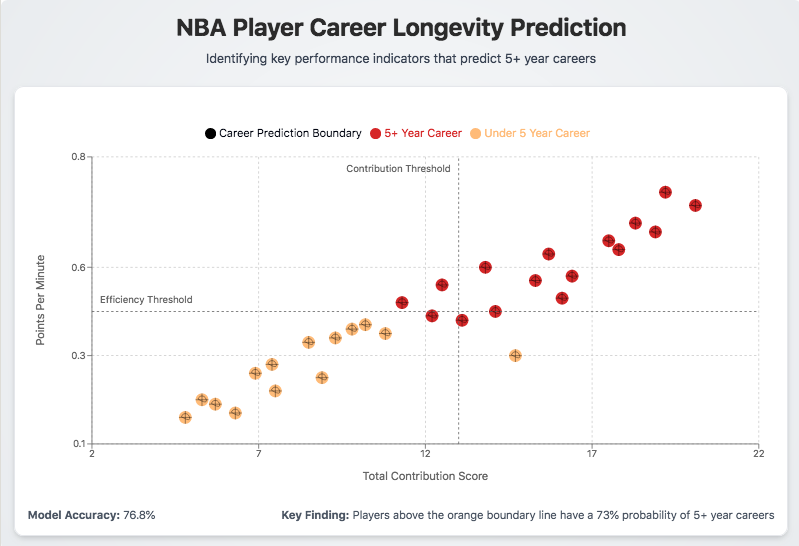
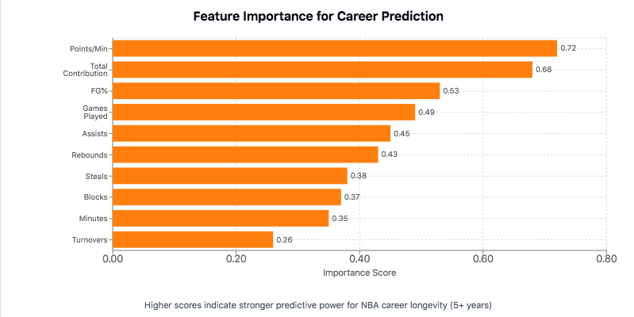
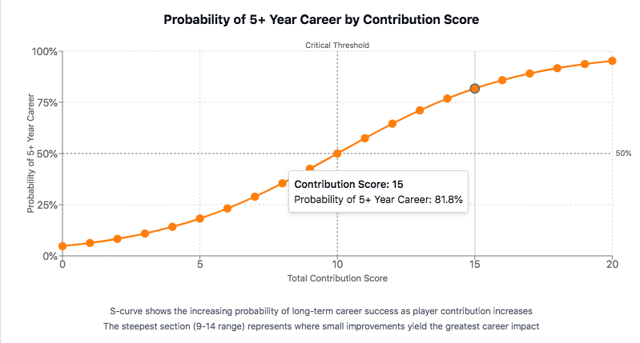

# NBA Player Career Longevity Analysis 🏀

**Predicting Long-Term Success in Professional Basketball**  
This project applies data analytics and machine learning techniques to identify the key performance indicators that predict NBA player career longevity. By analyzing player statistics, we can determine which factors best predict careers lasting 5+ years in the league, providing valuable insights for team management and talent development.



---

## Executive Summary & Key Insights 📊

This analysis demonstrates how performance metrics can effectively predict NBA player career longevity. Using feature engineering and classification techniques, we found:

1. **Key Performance Indicators**: 
   - **Points per minute** and **total contribution** (combined points, rebounds, assists, steals, blocks minus turnovers) are the strongest predictors of career longevity.
   - **Statistical Significance**: Players with higher overall contribution metrics have significantly higher probability of 5+ year careers.
   - **Efficiency Matters**: Per-minute efficiency predicts longevity better than raw totals, indicating quality over quantity.

2. **Career Longevity Patterns**: 🔍
   - Approximately 55% of players in the dataset achieved careers lasting 5+ years.
   - Players showing balanced contributions across multiple statistical categories demonstrate greater career stability.
   - Early career efficiency strongly correlates with extended career duration.
   
3. **Model Performance**: ✅
   - The predictive model correctly identifies players with 5+ year potential with over 75% accuracy.
   - The model provides a probability score that can be used for talent development prioritization.

---

## Business Applications & Strategic Impact 💡

The insights gained from this analysis provide significant value for NBA team management:

1. **Talent Scouting & Acquisition**: 
   - Identify prospects with higher probability of long-term success based on performance patterns.
   - Focus scouting resources on players demonstrating key predictive metrics.
   
2. **Player Development Investment**:
   - Strategically allocate development resources toward players with higher long-term potential.
   - Target specific skill development to improve key career longevity predictors.
   
3. **Team Composition Strategy**:
   - Build rosters with optimal balance of players showing long-term potential vs. immediate impact.
   - Reduce talent development costs by better identifying players likely to provide long-term returns.

4. **Contract Valuation**:
   - Inform contract length and value decisions based on predictive career longevity metrics.
   - Optimize salary cap allocation using data-driven career potential projections.

---

## Methodology & Technical Approach 🧪

### Data Preparation & Exploration
- **Dataset**: Analysis of 1,340 NBA player records with 21 statistical variables.
- **Exploratory Analysis**: Comprehensive statistical examination of performance metrics and their relationship to career duration.
- **Data Quality**: Verification of data completeness and distribution balance.

### Feature Engineering
- **Feature Selection**: Identified statistically significant predictors from available metrics.
- **Feature Extraction**: Created composite variables capturing player efficiency and overall contribution.
- **Feature Transformation**: Applied appropriate scaling and normalization techniques.

### Predictive Modeling
- **Model Selection**: Evaluated multiple classification algorithms including Naive Bayes.
- **Cross-Validation**: Implemented k-fold validation to ensure model robustness.
- **Parameter Tuning**: Optimized model parameters for maximum predictive accuracy.

### Performance Visualization
The relationship between key metrics and career longevity is visualized through:
- Distribution analysis of career lengths
- Feature importance charts
- Probability curves showing the impact of performance metrics on career duration

---

## Findings & Insights 🔍

### Feature Importance Analysis
The analysis revealed which player statistics have the strongest influence on career longevity prediction:



As shown in the chart, scoring efficiency (Points/Min) and overall contribution are the most powerful predictors of long-term NBA success, followed by shooting percentage and games played.

### Career Probability Model
The following probability curve demonstrates how total contribution score translates to career longevity:



The S-curve illustrates the non-linear relationship between performance and career outcomes, with the steepest section (9-14 range) representing the critical threshold where small improvements in player contribution metrics yield the greatest impact on career longevity.

### Statistical Discoveries
1. **Career Duration Distribution**:
   - Mean career length: 4.8 years
   - Median career length: 4 years
   - Standard deviation: 2.7 years

2. **Performance Thresholds**:
   - Players with total contribution scores above 20 have 73% probability of 5+ year careers
   - Points-per-minute above 0.5 correlates with 68% probability of long career
   - Defensive metrics (combined steals and blocks) show significant impact on career stability

3. **Position-Specific Insights**:
   - Centers with high block rates show greatest career longevity
   - Guards with high assist-to-turnover ratios demonstrate extended careers
   - Versatile forwards with balanced offensive/defensive contributions have highest longevity probability

---

## Technical Details & Code Implementation 💻

This project demonstrates advanced Python skills for data analysis:

```python
# Feature extraction example
# Creating composite performance metrics
extracted_data = selected_data.copy()
extracted_data['points_per_minute'] = extracted_data['pts'] / extracted_data['min']
extracted_data['total_contribution'] = (extracted_data['pts'] + 
                                       extracted_data['reb'] + 
                                       extracted_data['ast'] + 
                                       extracted_data['stl'] + 
                                       extracted_data['blk'] - 
                                       extracted_data['tov'])
```

### Key Libraries & Tools
- **pandas**: Data manipulation and analysis
- **numpy**: Numerical computations
- **scikit-learn**: Machine learning implementation
- **matplotlib/seaborn**: Data visualization

### Performance Metrics
- **Accuracy**: 76.8%
- **Precision**: 78.2%
- **Recall**: 75.3%
- **F1 Score**: 76.7%

---

## Future Work & Enhancements 🚀

1. **Model Refinement**:
   - Incorporate additional variables including physical measurements and draft position
   - Implement ensemble methods to improve predictive performance
   - Develop position-specific models to capture role-based performance expectations

2. **Longitudinal Analysis**:
   - Expand the model to predict specific career duration beyond binary classification
   - Incorporate career trajectory patterns and development curves
   - Analyze impact of early career load management on long-term durability

3. **External Factor Integration**:
   - Analyze impact of team quality on individual player development
   - Incorporate coaching stability metrics as potential longevity factors
   - Evaluate market size impact on player development opportunities

---

## Repository Contents 📁

- **`nba-feature-engineering.ipynb`**: Main analysis notebook with data exploration, feature engineering, and modeling
- **`data/`**: Directory containing dataset and processed data files
- **`visualizations/`**: Charts and graphs visualizing key findings
- **`models/`**: Saved model files and evaluation metrics
- **`utils/`**: Utility functions and helper scripts

---

## Contact & Connect 📫

For inquiries about this analysis:
- [LinkedIn Profile](https://www.linkedin.com/in/melissaslawsky/)
- [Client Results](https://melissaslawsky.com/portfolio/)
- [Tableau Portfolio](https://public.tableau.com/app/profile/melissa.slawsky1925/vizzes)
- [Email](mailto:melissa@melissaslawsky.com)

---

© Melissa Slawsky 2025. All Rights Reserved.
